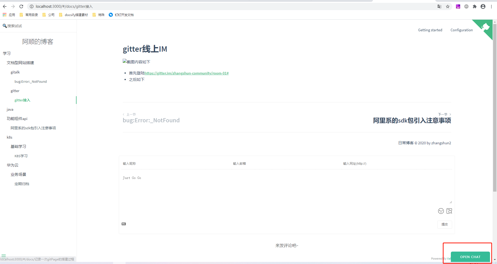
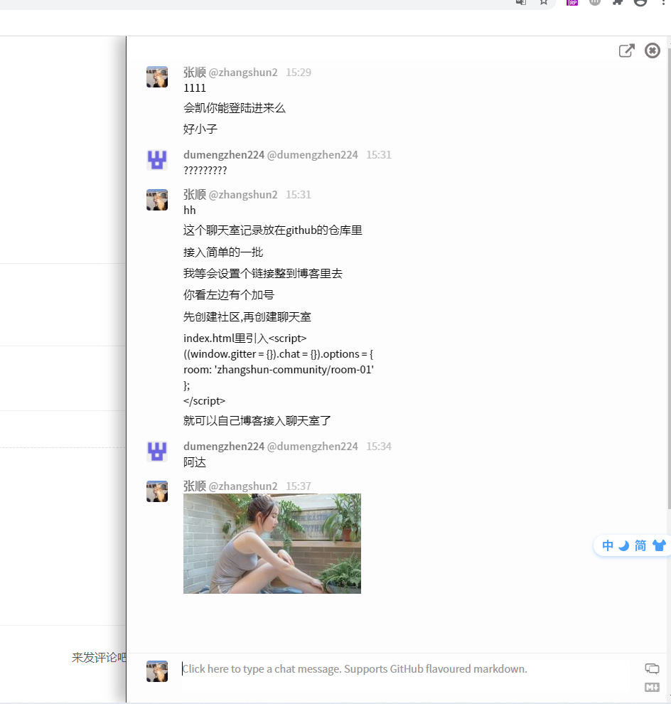

# gitter线上IM
---

* 首先登陆https://gitter.im/zhangshun-community/room-01#
* 之后如下点击左侧的+号.首先创建社区
* 之后创建聊天室
* 此时拷贝你的```社区名称/聊天室名称``` as 数据A

~~~javascript
<script>
  ((window.gitter = {}).chat = {}).options = {
    // 这是就是上面的数据A 
    room: 'zhangshun-community/room-01'
  };
</script>
~~~

---

此时更新你的网站即可.刚才的聊天室已经接入
效果图如下
> <br>
> 


