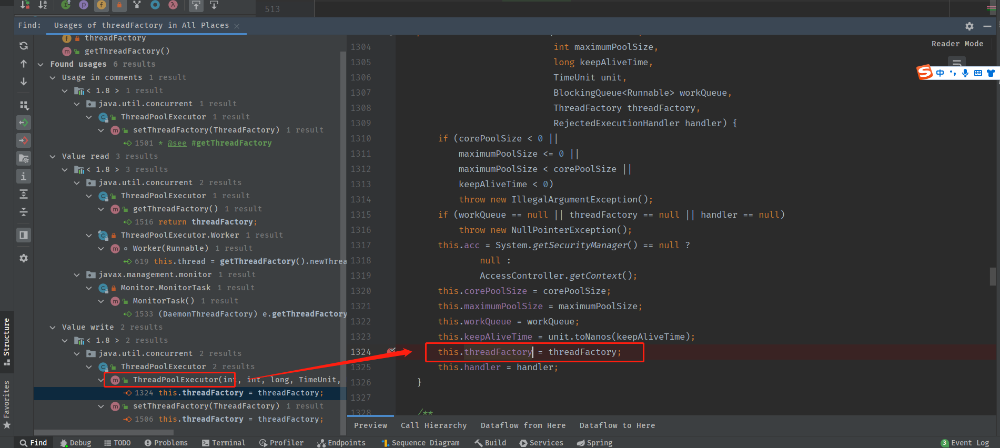
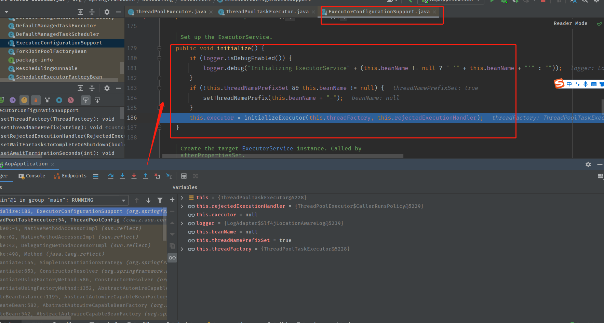

# 关于JUC的ThreadPoolExecutor的探讨


## 起因

#### 发现了同事@EnableAsync和@Async结合线程池使用的代码,想看下如何实现的

代码如下

~~~java
@Component
@EnableAsync
public class ThreadPoolConfig {
    /** 核心线程池大小 **/
    private final static int corePoolSize = 2;

    /** 最大可创建的线程数 密集型*2 **/
    private final static int maxPoolSize = Runtime.getRuntime().availableProcessors();

    /** 队列最大长度 **/
    private final static int queueCapacity = 500;

    /** 线程池维护线程所允许的空闲时间 **/
    private final static int keepAliveSeconds = 300;


    @Bean(name = "ThreadPoolTaskExecutor")
    public ThreadPoolTaskExecutor threadPoolTaskExecutor() {
        ThreadPoolTaskExecutor executor = new ThreadPoolTaskExecutor();
        // 为线程设置初始的线程数量 1
        executor.setCorePoolSize(1);
        // 为线程设置最大的线程数量
        executor.setMaxPoolSize(maxPoolSize);
        // 为任务队列设置最大 任务数量
        executor.setQueueCapacity(queueCapacity);
        // 设置 超出初始化线程的 存在时间为60秒
        // 也就是 如果现有线程数超过5 则会对超出的空闲线程 设置摧毁时间 也就是60秒
        executor.setKeepAliveSeconds(keepAliveSeconds);
        // 设置 线程前缀
        executor.setThreadNamePrefix("channel-name-");
        executor.setThreadGroupName("channelGroup-");
        // 线程池的饱和策略 我这里设置的是 CallerRunsPolicy 也就是由用调用者所在的线程来执行任务 共有四种
        // AbortPolicy：直接抛出异常，这是默认策略；
        // CallerRunsPolicy：用调用者所在的线程来执行任务；
        // DiscardOldestPolicy：丢弃阻塞队列中靠最前的任务，并执行当前任务；
        // DiscardPolicy：直接丢弃任务；
        executor.setRejectedExecutionHandler(new ThreadPoolExecutor.CallerRunsPolicy());
        // 设置在关闭线程池时是否等待任务完成
        executor.setWaitForTasksToCompleteOnShutdown(true);
        // 注意这里 : 这里是错的
        executor.setThreadFactory(Executors.defaultThreadFactory());
        executor.initialize();
        // 设置等待终止的秒数
        // 返回设置完成的线程池
        // System.out.println("这里获取threadFactory: " + executor.getThreadPoolExecutor().getThreadFactory());
        return executor;
    }
}
~~~

#### 	提前避雷

~~~java
// 注意这里 : 这里是错的
        executor.setThreadFactory(Executors.defaultThreadFactory());
~~~

#### 调用的地方

~~~java
@Service
public class AsyncSplit {

    @Async(value = "ThreadPoolTaskExecutor")
    public void test(){
        System.out.println(Thread.currentThread().getName());
        for (int i = 0; i < 10; i++) {
            System.out.println("哈哈哈哈");
        }
        System.out.println("测试只有@Async注解\n的时候能不能打印出来");
    }
}
~~~

#### 预期结果

System.out.println(Thread.currentThread().getName());

打印的结果的线程名称前缀一定是channel-name-开头的

#### 真实结果

不是

#### 走源码反推

##### 查看@EnableAsync注解

~~~java
@Target(ElementType.TYPE)
@Retention(RetentionPolicy.RUNTIME)
@Documented
@Import(AsyncConfigurationSelector.class)
public @interface EnableAsync {
~~~

##### 这里import进来一个bean  AsyncConfigurationSelector

~~~java
public class AsyncConfigurationSelector extends AdviceModeImportSelector<EnableAsync> {

	private static final String ASYNC_EXECUTION_ASPECT_CONFIGURATION_CLASS_NAME =
			"org.springframework.scheduling.aspectj.AspectJAsyncConfiguration";


	/**
	 * Returns {@link ProxyAsyncConfiguration} or {@code AspectJAsyncConfiguration}
	 * for {@code PROXY} and {@code ASPECTJ} values of {@link EnableAsync#mode()},
	 * respectively.
	 */
	@Override
	@Nullable
	public String[] selectImports(AdviceMode adviceMode) {
		switch (adviceMode) {
			case PROXY:
				return new String[] {ProxyAsyncConfiguration.class.getName()};
			case ASPECTJ:
				return new String[] {ASYNC_EXECUTION_ASPECT_CONFIGURATION_CLASS_NAME};
			default:
				return null;
		}
	}

}
~~~

##### 这里指向了ProxyAsyncConfiguration

~~~java
@Bean(name = TaskManagementConfigUtils.ASYNC_ANNOTATION_PROCESSOR_BEAN_NAME)
	@Role(BeanDefinition.ROLE_INFRASTRUCTURE)
	public AsyncAnnotationBeanPostProcessor asyncAdvisor() {
		Assert.notNull(this.enableAsync, "@EnableAsync annotation metadata was not injected");
		AsyncAnnotationBeanPostProcessor bpp = new AsyncAnnotationBeanPostProcessor();
		bpp.configure(this.executor, this.exceptionHandler);
		Class<? extends Annotation> customAsyncAnnotation = this.enableAsync.getClass("annotation");
		if (customAsyncAnnotation != AnnotationUtils.getDefaultValue(EnableAsync.class, "annotation")) {
			bpp.setAsyncAnnotationType(customAsyncAnnotation);
		}
		bpp.setProxyTargetClass(this.enableAsync.getBoolean("proxyTargetClass"));
		bpp.setOrder(this.enableAsync.<Integer>getNumber("order"));
		return bpp;
	}
~~~

##### 这里new了一个bean的后置处理器new AsyncAnnotationBeanPostProcessor();

到了这里一般而言就很明确了,以注解为标识,触发bean后置处理器的前后置方法,或者初始化beanfactory的方法来获取一个注解增强对象

这里直接在AsyncAnnotationBeanPostProcessor类里全文检索Advice或者Advisor

~~~java
	@Override
	public void setBeanFactory(BeanFactory beanFactory) {
		super.setBeanFactory(beanFactory);

		AsyncAnnotationAdvisor advisor = new AsyncAnnotationAdvisor(this.executor, this.exceptionHandler);
		if (this.asyncAnnotationType != null) {
			advisor.setAsyncAnnotationType(this.asyncAnnotationType);
		}
		advisor.setBeanFactory(beanFactory);
		this.advisor = advisor;
	}
~~~

##### 获取了增强对象AsyncAnnotationAdvisor

这里我们继续根据增强对象关键词去查找

~~~java
	private Advice advice;
	this.advice = buildAdvice(executor, exceptionHandler);
	protected Advice buildAdvice(
			@Nullable Supplier<Executor> executor, @Nullable Supplier<AsyncUncaughtExceptionHandler> exceptionHandler) {

		AnnotationAsyncExecutionInterceptor interceptor = new AnnotationAsyncExecutionInterceptor(null);
		interceptor.configure(executor, exceptionHandler);
		return interceptor;
	}
~~~

##### 获取了拦截对象AnnotationAsyncExecutionInterceptor

~~~java
public class AnnotationAsyncExecutionInterceptor extends AsyncExecutionInterceptor
~~~


无具体实现

##### 查看父类AsyncExecutionInterceptor

查看继承和实现关系

~~~java
public class AsyncExecutionInterceptor extends AsyncExecutionAspectSupport implements MethodInterceptor, Ordered {
~~~

可知这是个自定义的方法拦截器

##### 直接去查看invoke

~~~java
@Override
    @Nullable
    public Object invoke(final MethodInvocation invocation) throws Throwable {
        Class<?> targetClass = (invocation.getThis() != null ? AopUtils.getTargetClass(invocation.getThis()) : null);
        Method specificMethod = ClassUtils.getMostSpecificMethod(invocation.getMethod(), targetClass);
        final Method userDeclaredMethod = BridgeMethodResolver.findBridgedMethod(specificMethod);

        AsyncTaskExecutor executor = determineAsyncExecutor(userDeclaredMethod);
        if (executor == null) {
            throw new IllegalStateException(
                    "No executor specified and no default executor set on AsyncExecutionInterceptor either");
        }

        Callable<Object> task = () -> {
            try {
                System.out.println("源码打印: " + Thread.currentThread().getName());
                Object result = invocation.proceed();
                if (result instanceof Future) {
                    return ((Future<?>) result).get();
                }
            }
            catch (ExecutionException ex) {
                handleError(ex.getCause(), userDeclaredMethod, invocation.getArguments());
            }
            catch (Throwable ex) {
                handleError(ex, userDeclaredMethod, invocation.getArguments());
            }
            return null;
        };

        return doSubmit(task, executor, invocation.getMethod().getReturnType());
    }
~~~

##### 这里可以明确知道两点

##### 第一点: 当前的@Async注解声明的方法最后会以一个方法层面的拦截器+一个callable来实现

~~~java
        Callable<Object> task = () -> {
            try {
                System.out.println("源码打印: " + Thread.currentThread().getName());
                Object result = invocation.proceed();
                if (result instanceof Future) {
                    return ((Future<?>) result).get();
                }
            }
            catch (ExecutionException ex) {
                handleError(ex.getCause(), userDeclaredMethod, invocation.getArguments());
            }
            catch (Throwable ex) {
                handleError(ex, userDeclaredMethod, invocation.getArguments());
            }
            return null;
        };
~~~


##### 第二点:这里是支持主动声明线程池的

~~~java
return doSubmit(task, executor, invocation.getMethod().getReturnType());
~~~

~~~java
		Class<?> targetClass = (invocation.getThis() != null ? AopUtils.getTargetClass(invocation.getThis()) : null);
        Method specificMethod = ClassUtils.getMostSpecificMethod(invocation.getMethod(), targetClass);
        final Method userDeclaredMethod = BridgeMethodResolver.findBridgedMethod(specificMethod);

        AsyncTaskExecutor executor = determineAsyncExecutor(userDeclaredMethod);
~~~

##### 这里的executor的获取是根据拦截参数MethodInvocation invocation来的

~~~java
	@Override
    @Nullable
    public Object invoke(final MethodInvocation invocation)
~~~

##### 这里获取executor的方法是determineAsyncExecutor

我们点进去

~~~java
@Nullable
    protected AsyncTaskExecutor determineAsyncExecutor(Method method) {
        AsyncTaskExecutor executor = this.executors.get(method);
        if (executor == null) {
            Executor targetExecutor;
            String qualifier = getExecutorQualifier(method);
            if (StringUtils.hasLength(qualifier)) {
                targetExecutor = findQualifiedExecutor(this.beanFactory, qualifier);
            }
            else {
                targetExecutor = this.defaultExecutor.get();
            }
            if (targetExecutor == null) {
                return null;
            }
            executor = (targetExecutor instanceof AsyncListenableTaskExecutor ?
                    (AsyncListenableTaskExecutor) targetExecutor : new TaskExecutorAdapter(targetExecutor));
            this.executors.put(method, executor);
        }
        return executor;
    }
~~~

##### 可知实际获取线程池信息的方法是findQualifiedExecutor

~~~java
			 String qualifier = getExecutorQualifier(method);
            if (StringUtils.hasLength(qualifier)) {
                targetExecutor = findQualifiedExecutor(this.beanFactory, qualifier);
            }
~~~


我们继续点进去

~~~java
    protected Executor findQualifiedExecutor(@Nullable BeanFactory beanFactory, String qualifier) {
        if (beanFactory == null) {
            throw new IllegalStateException("BeanFactory must be set on " + getClass().getSimpleName() +
                    " to access qualified executor '" + qualifier + "'");
        }
        return BeanFactoryAnnotationUtils.qualifiedBeanOfType(beanFactory, Executor.class, qualifier);
    }
~~~

##### 我们继续往下看qualifiedBeanOfType

~~~java
	public static <T> T qualifiedBeanOfType(BeanFactory beanFactory, Class<T> beanType, String qualifier)
			throws BeansException {

		Assert.notNull(beanFactory, "BeanFactory must not be null");

		if (beanFactory instanceof ListableBeanFactory) {
			// Full qualifier matching supported.
			return qualifiedBeanOfType((ListableBeanFactory) beanFactory, beanType, qualifier);
		}
		else if (beanFactory.containsBean(qualifier)) {
			// Fallback: target bean at least found by bean name.
			return beanFactory.getBean(qualifier, beanType);
		}
		else {
			throw new NoSuchBeanDefinitionException(qualifier, "No matching " + beanType.getSimpleName() +
					" bean found for bean name '" + qualifier +
					"'! (Note: Qualifier matching not supported because given " +
					"BeanFactory does not implement ConfigurableListableBeanFactory.)");
		}
	}
~~~

这里其实已经能猜出来意思了

把指定的ThreadPoolExecutor托管给spring

这里可以通过指定的bean名称或者bean type去拿到指定的Executor

##### 我们继续往下看qualifiedBeanOfType

~~~java
	private static <T> T qualifiedBeanOfType(ListableBeanFactory bf, Class<T> beanType, String qualifier) {
		String[] candidateBeans = BeanFactoryUtils.beanNamesForTypeIncludingAncestors(bf, beanType);
		String matchingBean = null;
		for (String beanName : candidateBeans) {
			if (isQualifierMatch(qualifier::equals, beanName, bf)) {
				if (matchingBean != null) {
					throw new NoUniqueBeanDefinitionException(beanType, matchingBean, beanName);
				}
				matchingBean = beanName;
			}
		}
		if (matchingBean != null) {
			return bf.getBean(matchingBean, beanType);
		}
		else if (bf.containsBean(qualifier)) {
			// Fallback: target bean at least found by bean name - probably a manually registered singleton.
			return bf.getBean(qualifier, beanType);
		}
		else {
			throw new NoSuchBeanDefinitionException(qualifier, "No matching " + beanType.getSimpleName() +
					" bean found for qualifier '" + qualifier + "' - neither qualifier match nor bean name match!");
		}
	}
~~~

到这里第二点就结束了,这里是可以根据beanName去获取注入spring的线程池对象,从而在@async的时候指定使用的线程池

来更优雅的使用代码

### 结论

@EnableAsync开启了一个方法拦截器

@Async是指定了拦截的方法

@Async可以指定name=beanName来直接使用一个声明并注入spring的一个executor


### 补充

但是在声明的executor里有一行导致代码出现了问题

导致打印的当前线程名称的前缀并没有按照指定的来

~~~java
		// 注意这里 : 这里是错的
        executor.setThreadFactory(Executors.defaultThreadFactory());
~~~

这里就做一个初步调研并抛出新的问题

## 新问题

如果我们不写这一行,就能正常设置线程信息.

那么ThreadFactory是怎么set进这个executor中的呢

进入我们设置的bean

##### 进入ThreadPoolTaskExecutor

只有如下一个相关对象

~~~java
	@Nullable
	private ThreadPoolExecutor threadPoolExecutor;
~~~

##### 我们继续进入ThreadPoolExecutor

这里有两个关键信息

1.线程相关

~~~java
    private final HashSet<Worker> workers = new HashSet<Worker>();
~~~

这个是实际线程池do的逻辑,worker包装callable

2.线程池信息

~~~java
    private volatile ThreadFactory threadFactory;
~~~

这里我们就找到最后初始化的地方了

##### 我们使用idea查看ThreadFactory有几次初始化的过程

第一次


第二次



得出如上两次初始化的阶段

##### 开始在这两处打断点尝试向上debug

##### 第一次进来是空的

放开断点继续debug


##### 第二次进来也是空的

能看出来这里没有完全初始化


##### 第三次进来有值了

能看出来我们已经正常初始化了


##### 这时候开始向上debug


所以这里是加载了tomcat内置的一个executor

并没有加载到我们需要的

我们继续看





##### 这时候我们继续debug


发现重复加载了一次

代表这里代码init逻辑重复加载了一次


可知,这里的加载逻辑是实现了InitializingBean接口

把初始化逻辑写在了afterPropertiesSet里

并最终在

```
AbstractAutowireCapableBeanFactory
```

```
if (mbd != null && bean.getClass() != NullBean.class) {
   String initMethodName = mbd.getInitMethodName();
   if (StringUtils.hasLength(initMethodName) &&
         !(isInitializingBean && "afterPropertiesSet".equals(initMethodName)) &&
         !mbd.hasAnyExternallyManagedInitMethod(initMethodName)) {
      invokeCustomInitMethod(beanName, bean, mbd);
   }
}
```

最后可知,其实写在bean初始化的逻辑里了.写在这里去触发executor的ThreadFactory的初始化

### 使用模板

* 在任意bean上声明@EnableAsync注解
* 声明一个executor并托管给spring,并声明名称
* @Async(name="上一步声明的名称")

就可以直接使用指定的线程池去做异步处理,灵活的把线程池的使用和异步注解使用在一起.节省了代码量

缺点: 不通的场景需要声明不通的executor当做bean

代码模板如下

##### 在任意bean上声明@EnableAsync注解并声明一个executor并托管给spring,并声明名称

~~~java
@Component
@EnableAsync
public class ThreadPoolConfig {
    /** 核心线程池大小 **/
    private final static int corePoolSize = 2;

    /** 最大可创建的线程数 密集型*2 **/
    private final static int maxPoolSize = Runtime.getRuntime().availableProcessors();

    /** 队列最大长度 **/
    private final static int queueCapacity = 500;

    /** 线程池维护线程所允许的空闲时间 **/
    private final static int keepAliveSeconds = 300;


    @Bean(name = "ThreadPoolTaskExecutor")
    public ThreadPoolTaskExecutor threadPoolTaskExecutor() {
        ThreadPoolTaskExecutor executor = new ThreadPoolTaskExecutor();
        // 为线程设置初始的线程数量 1
        executor.setCorePoolSize(1);
        // 为线程设置最大的线程数量
        executor.setMaxPoolSize(maxPoolSize);
        // 为任务队列设置最大 任务数量
        executor.setQueueCapacity(queueCapacity);
        // 设置 超出初始化线程的 存在时间为60秒
        // 也就是 如果现有线程数超过5 则会对超出的空闲线程 设置摧毁时间 也就是60秒
        executor.setKeepAliveSeconds(keepAliveSeconds);
        // 设置 线程前缀
        executor.setThreadNamePrefix("channel-name-");
        executor.setThreadGroupName("channelGroup-");
        // 线程池的饱和策略 我这里设置的是 CallerRunsPolicy 也就是由用调用者所在的线程来执行任务 共有四种
        // AbortPolicy：直接抛出异常，这是默认策略；
        // CallerRunsPolicy：用调用者所在的线程来执行任务；
        // DiscardOldestPolicy：丢弃阻塞队列中靠最前的任务，并执行当前任务；
        // DiscardPolicy：直接丢弃任务；
        executor.setRejectedExecutionHandler(new ThreadPoolExecutor.CallerRunsPolicy());
        // 设置在关闭线程池时是否等待任务完成
        executor.setWaitForTasksToCompleteOnShutdown(true);
        return executor;
    }
}

~~~

##### 使用

~~~java
@Service
public class AsyncSplit {

    @Async(value = "ThreadPoolTaskExecutor")
    public void test(){
        System.out.println(Thread.currentThread().getName());
        for (int i = 0; i < 10; i++) {
            System.out.println("哈哈哈哈");
        }
        System.out.println("测试只有@Async注解\n的时候能不能打印出来");
    }
}
~~~


### 额外文献

AdviceModeImportSelector